О проекте
=========

***********
Возможности
***********

Наш сайт разработан для общения людей по всему миру.

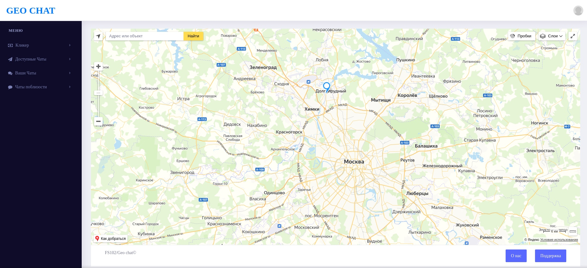

Возможности:

* `Создание комнат`_
* `Заработок монет`_
* `Общение`_
* `Гибкая настройка профиля`_

Начало работы с сайтом
======================

Для начала работы с сайтом вам нужно **зарегестрироваться**.

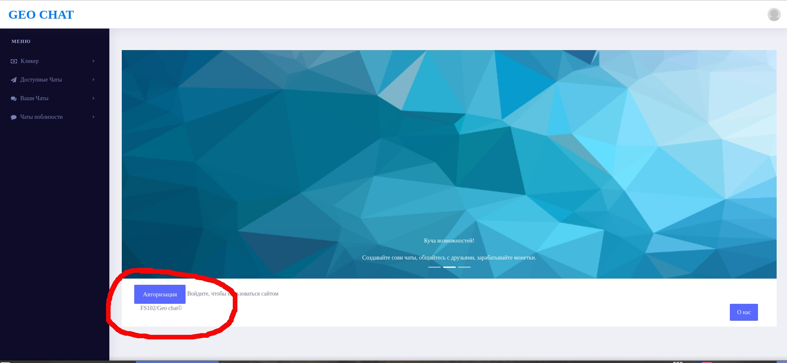

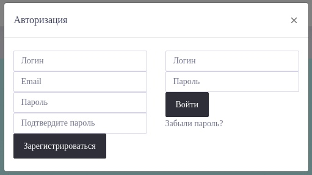

************
Главное меню
************

Боковая панель меню отображает:

* **Кликер**, с помощью которого вы можете зарабатывать монетки;
* **Доступные чаты**, чаты, которые вы можете видеть и присоединяться к ним, даже если они далеко от вас;
* **Ваши чаты**, чаты, к которым вы уже присоединились;
* **Чаты поблизости**, чаты, находящиеся рядом с вами

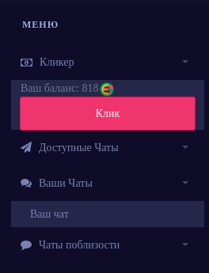

***************
Создание комнат
***************

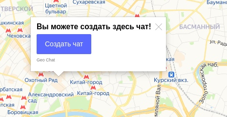

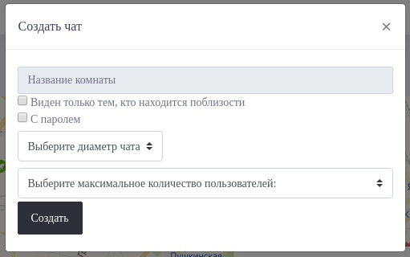

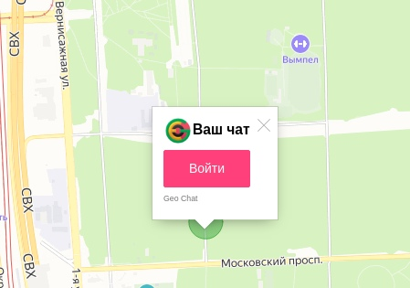

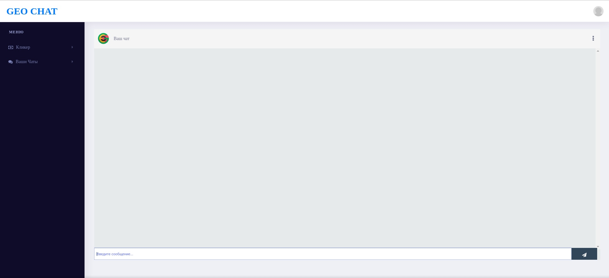

В комнатах так же присутствуют **настройки**.

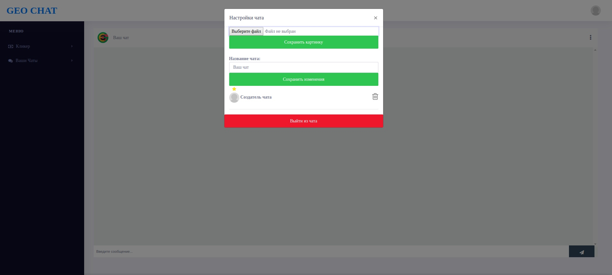

***************
Заработок монет
***************

С помощью кликера, расположенного в боковом меню, вы можете зарабатывать монетки, для создания чатов.

*******
Общение
*******

Общайтесь с людьми и заводите новые знакомства.

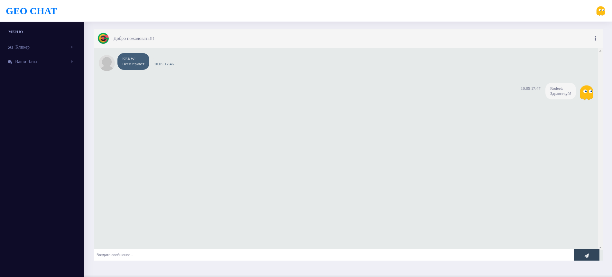

****************
Красивый профиль
****************

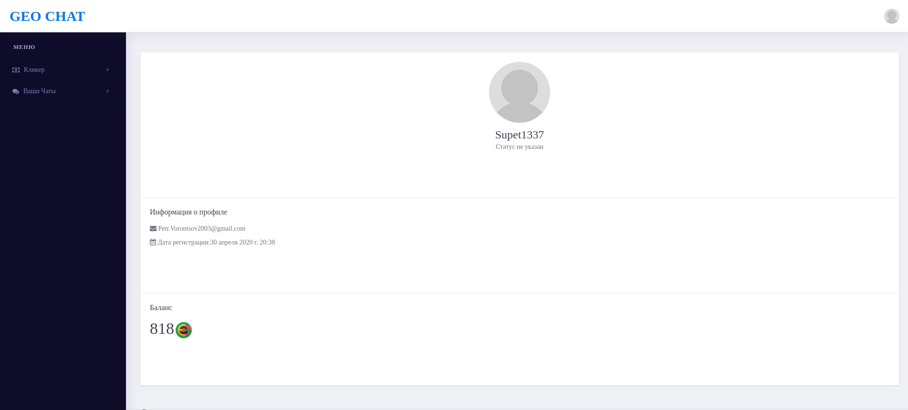

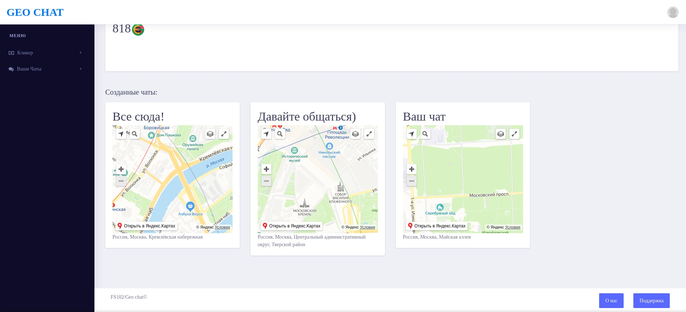

************************
Гибкая настройка профиля
************************

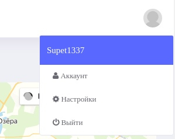

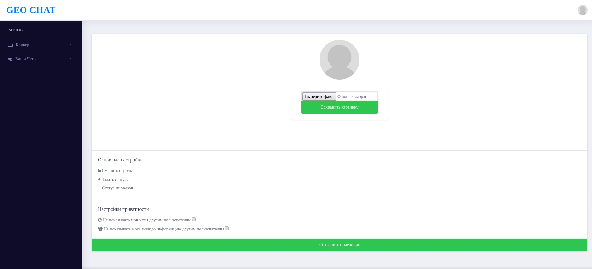

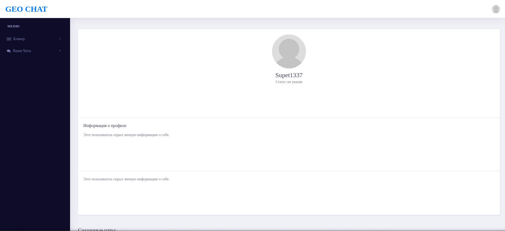

Изменение пароля
================

Если вы забыли или хотите изменить свой пароль, для этого нажмите на `забыли пароль?`_ в окне регистрации или `сменить пароль`_ на странице редактирования профиля соответственно.

**************
Забыли пароль?
**************

Далее выполните `действия для смены пароля`_.

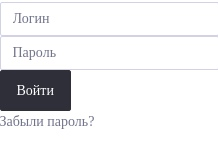

**************
Сменить пароль
**************

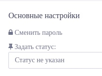

Далее выполните `действия для смены пароля`_.

*************************
Действия для смены пароля
*************************

1. Введите ваш адрес электронной почты.

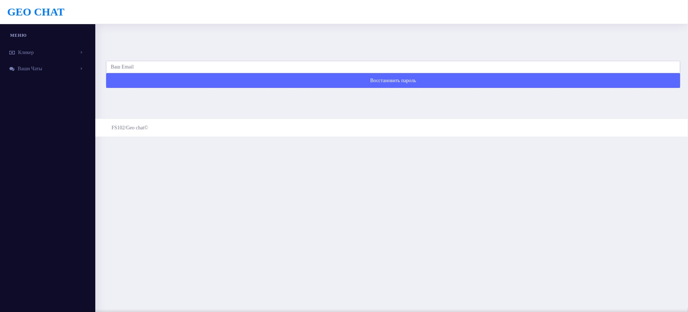

2. Ожидайте письмо(если письмо не пришло, проверьте спам).

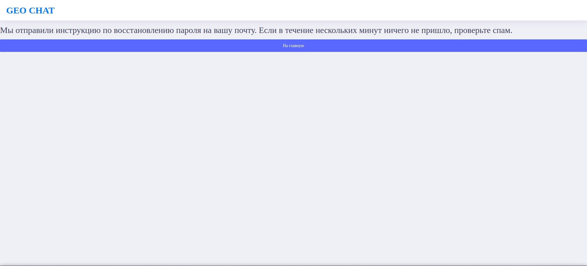

3. Перейдите по ссылке.

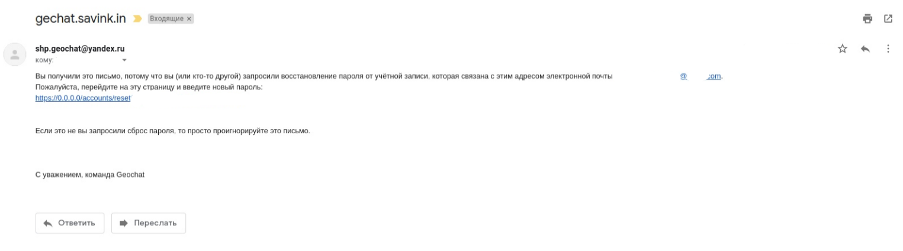

4. Введите новый пароль.

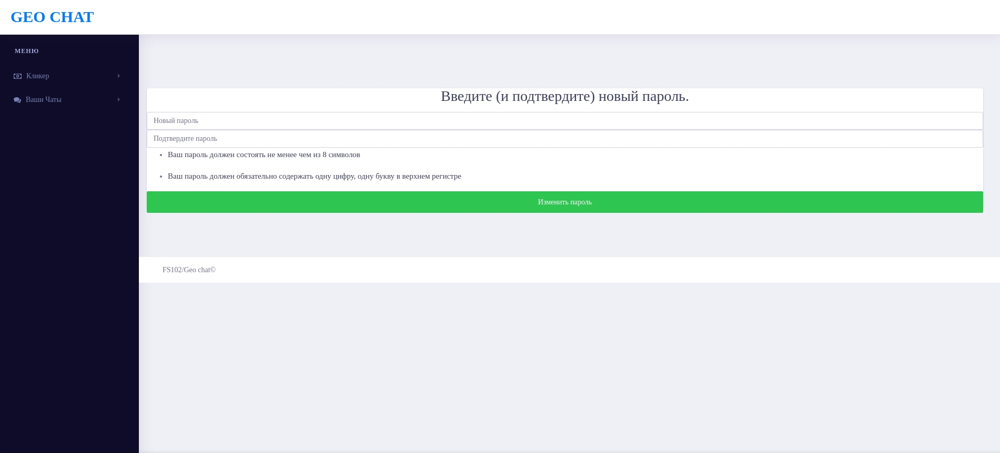

5. Готово!

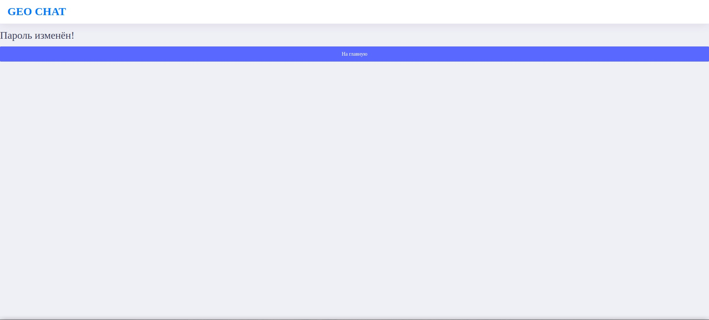